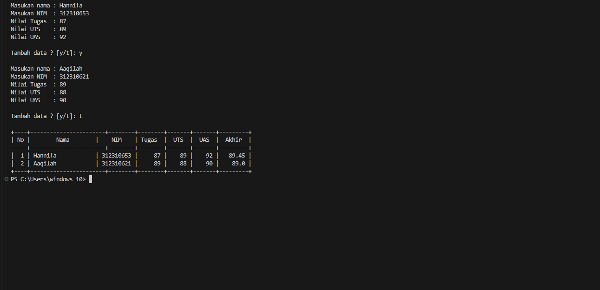

# Praktikum 9 

# Latihan
## Buat sebuah list sebanyak 5 elemen 
``list_1 = [1, 2, 3, "Hello", "Python"]``

## Akses list
## Tampilkan elemen ke 3
`print("Elemen ke-3:", list_1[2])`

## Ambil nilai elemen ke 2 sampai elemen ke 4
`print("Nilai elemen ke-2 sampai ke-4:", list_1[1:4])`

## Ambil elemen terakhir
`print("Elemen terakhir:", list_1[-1])`

## Ubah elemen list
## Ubah elemen ke-4 dengan nilai lainnya
`list_1[3] = "Hai"`
```print("List setelah mengubah elemen ke-4:", list_1)```

## Ubah elemen ke-4 sampai dengan elemen terakhir
`list_1[3:] = ["Hi", 5]`
`print("List setelah mengubah elemen ke-4 sampai dengan elemen terakhir:", list_1)`

## Tambah elemen list
## Ambil 2 bagian dari list pertama dan jadikan list ke-2
`list_2 = list_1[1:3]`
`print("List 1:", list_2)`

## Tambah list 2 dengan nilai string
`list_2.append("Hello")`
`print("List 2 setelah menambah nilai string:", list_2)`

## Tambah list 2 dengan 3 nilai
`list_2.extend([5, 6, 7])`
`print("List 2 setelah menambah 3 nilai:", list_2)`

## Gabungkan list 2 dengan list 1
`list_1.extend(list_2)`
`print("List 1 setelah digabung dengan list 2:", list_1)`


# Output


# Praktikum


# Flowchart


# Output


